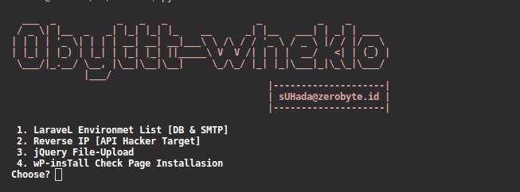

# 0byttt-wheklo
wheklo is tools hacking with python program
if you are windows user, you must install <a href="https://git-scm.com/downloads">Git Bash Download</a>

### Installation :
```
$ git clone https://github.com/zerobyte-id/0byttt-wheklo.git
$ cd 0byttt-wheklo/
$ chmod +x install.sh
$ ./install.sh
```

Usage : python wheklo.py




### Tools :
1. LaraveL Environmet List [DB & SMTP]
2. Reverse IP [API Hacker Target]
3. jQuery File-Upload Exploit
4. wP-insTall Check Page Installasion

#### Note : 
 * Dont change shell , that just uploader.
 * Your list-domains.txt please use protocol http://domain.com , not domain.com
 
   example : 
   
   ```$ cat list-domains.txt
   http://www.facebook.com
   http://youtube.com
   ```
